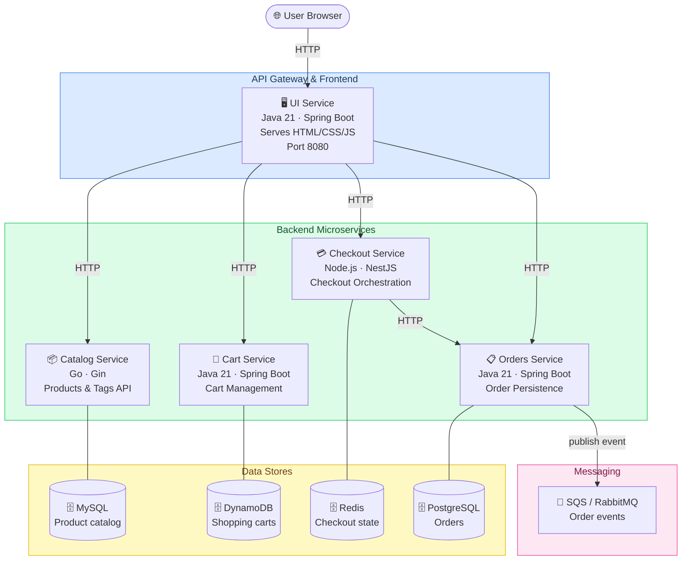

# The Store — Architecture

## Overview

**The Store** is a polyglot microservices e-commerce platform. A Java/Spring Boot UI acts as a frontend and API gateway, delegating to four backend services written in different languages and stacks.

---

## Architecture Diagram

> All services also have in-memory fallbacks for local development (no external DB required).

---

## Services

### UI Service — `src/ui/` · Java 21, Spring Boot
The entry point for the browser. Renders server-side HTML templates and calls the four backend services via HTTP. Handles sessions, shopping themes, and an optional AI chatbot (AWS Bedrock, OpenAI, or mock).

### Catalog Service — `src/catalog/` · Go, Gin
RESTful API for products and tags. Backed by MySQL or in-memory data. Supports filtering, pagination, and tag-based search.

### Cart Service — `src/cart/` · Java 21, Spring Boot
Manages per-customer shopping carts. Persists items in Amazon DynamoDB (or in-memory). Supports cart merging for guest-to-user transitions.

### Checkout Service — `src/checkout/` · Node.js, NestJS
Orchestrates the checkout workflow. Stores transient checkout state in Redis (or in-memory), computes item subtotals, applies tax, and fetches shipping rates before forwarding the final order to the Orders service.

### Orders Service — `src/orders/` · Java 21, Spring Boot
Creates and retrieves orders. Persists to PostgreSQL (or in-memory) and publishes order events to SQS, RabbitMQ, or an in-memory bus.

---

## Cross-Cutting Concerns

| Concern | Approach |
|---|---|
| Observability | OpenTelemetry + AWS X-Ray, Prometheus metrics |
| Health checks | Spring Actuator / NestJS Terminus on every service |
| Chaos engineering | `/chaos/*` endpoints on every service (inject latency, force status codes) |
| Local development | `local.sh` spins up a Kind (Kubernetes) cluster with Helm |
| E2E tests | Cypress (`src/e2e/`) — home, catalog, cart, checkout |
| Load tests | Artillery (`src/load-generator/`) — 10-minute stress scenarios |
| Deployment | Kubernetes manifests in `dist/kubernetes.yaml` |

---

## Data Flow — Checkout Example

1. User adds items → **Cart Service** stores them in DynamoDB.
2. User initiates checkout → **UI** calls **Checkout Service**, which caches state in Redis.
3. User confirms → **Checkout Service** calls **Orders Service** via HTTP.
4. **Orders Service** saves the order to PostgreSQL and publishes an event to the message broker.
