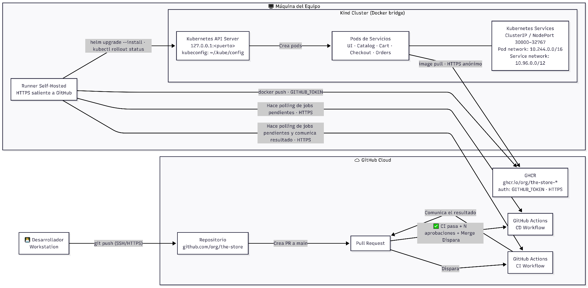

# Redes de Información pre-entrega TPE: CI/CD para The Store             

Grupo 9

Franco Morroni (Leg. Nº 60417), [fmorroni@itba.edu.ar](mailto:fmorroni@itba.edu.ar)

Tobías Pugliano (Leg. Nº 62180), [tpugliano@itba.edu.ar](mailto:tpugliano@itba.edu.ar)

Bernardo Zapico (Leg. Nº 62318),  [bzapico@itba.edu.ar](mailto:bzapico@itba.edu.ar)

21 de abril de 2026

**Este documento queda prohíbido modificarlo.**

## **1\. Planteo del Problema y Contexto**

Este proyecto aborda el **Tema \#7: CI/CD para el Despliegue y Gestión de Servicios**.

**The Store** es una plataforma de e-commerce compuesta por cinco microservicios independientes (UI, Catalog, Cart, Checkout, Orders) escritos en Java, Go y Node.js. Cada servicio cuenta con su propio Dockerfile para la creación del contenedor del servicio y se despliega en un cluster Kubernetes gestionado con Kind.

Sin un **pipeline de CI/CD**, cualquier cambio de código requiere correr los tests, construir la imagen Docker, publicarla en un registro y ejecutar la lógica manualmente para actualizar el cluster de Kubernetes. Este es un proceso lento, propenso a errores y no reproducible entre los miembros del equipo. El objetivo es automatizar completamente el ciclo build → test → push → deploy.

## **2\. Diseño de la Solución** 

### **Herramientas**

* **Github**: Repositorio central del código y punto de disparo de los pipelines de CI/CD mediante GitHub Actions.  
* **GitHub Actions (CI)**: Orquestación del pipeline de CI, se ejecuta en un runner self-hosted de GitHub al abrir una PR contra main.  
* **GitHub Actions (CD)**: Orquestación del pipeline de CD, se ejecuta en un runner self-hosted al hacer merge a main.  
* **Runner self-hosted**: Es el servidor que corre el flujo CI/CD. Realiza polling activo hacia GitHub Actions (HTTPS saliente) para consultar si hay jobs pendientes; es el runner quien inicia la conexión, no GitHub quien la despacha. Instalado en la máquina del equipo, accede al cluster Kind local vía localhost para el caso del CD.  
* **Docker**: Construye imágenes por servicio. También ejecuta los nodos de Kind como contenedores.  
* **GHCR (ghcr.io)**: Para registro de imágenes. Es gratuito para imágenes públicas y requiere autenticación nativa con GITHUB\_TOKEN.  
* **Helm**: Despliega cada servicio en el cluster Kind usando charts dedicados por servicio. Se creará un Helm chart por cada uno de los cinco microservicios (UI, Catalog, Cart, Checkout, Orders), definiendo sus Deployments, Services y ConfigMaps correspondientes.  
* **Kind**: Cluster Kubernetes local. Los nodos corren como contenedores Docker.

**Workflow CI/CD**

Las ramas protegen main mediante reglas de branch protection: todo cambio debe ingresar por Pull Request. El flujo completo es:

1. El desarrollador trabaja en una rama de algún feature y abre una PR contra main.  
2. La apertura del PR dispara automáticamente el **workflow de CI** en GitHub Actions.   
3. El runner self-hosted, mediante polling activo, detecta y toma el job pendiente.  
4. El runner self-hosted ejecuta la construcción de la imagen Docker del servicio y corre los tests unitarios. Si los tests fallan, el pipeline aborta y el PR queda bloqueado para merge.  
5. La aprobación del PR para merge sólo es posible si el CI pasó exitosamente y al menos N administradores aprobaron la PR (branch protection rules).  
6. Se realiza el merge sobre main, lo que dispara automáticamente el **workflow de CD** en GitHub Actions.   
7. El runner self-hosted, mediante polling activo, detecta y toma el job pendiente.  
8. El runner self-hosted construye y publica la imagen en GHCR con el SHA del commit como tag, y luego ejecuta helm upgrade \--install para desplegar el servicio en el cluster Kind local. Finalmente verifica el estado del Deployment con kubectl rollout status, en caso de fallo ejecuta helm rollback automáticamente y se aborta el nuevo despliegue.

### **Decisiones de Diseño Clave**

* **Runner self-hosted unificado con aislamiento lógico por servicio:** Tanto el pipeline de CI como el de CD se ejecutan en el mismo runner self-hosted, instalado en la máquina del equipo. Este enfoque nos independiza de los costos y tiempos  de la nube de GitHub. Principalmente, facilita el deployment al resolver el problema de accesibilidad de red: un runner externo en la nube de GitHub no podría comunicarse con el cluster Kind local sin la necesidad de exponer la red privada a internet. Al ejecutar el runner en la misma máquina anfitriona, este interactúa de forma nativa y directa con el API Server de Kubernetes (vía 127.0.0.1), aprovechando el contexto local (\~/.kube/config) y la caché de Docker del host. Esto simplifica la gestión de credenciales, acelera los tiempos de build y mejora la consistencia entre lo testeado y lo desplegado.  
* **Pipeline por servicio con filtro por path:** un cambio en un servicio específico sólo dispara el pipeline CI/CD de ese servicio, evitando rebuilds innecesarios. Esto se consigue mediante workflows configurados con filtros por path en GitHub Actions y charts Helm independientes por servicio.  
* **Autenticación:** GITHUB\_TOKEN (auto-provisionado) se usa para hacer push a GHCR. No se requieren secretos adicionales, Kind descarga las imágenes públicas sin pull secret.

## **3\. Alcance del POC y Casos de Uso**

Se definen cuatro casos de uso concretos que delimitan el alcance del POC:

### **Caso 1: PR Abierto**

Un desarrollador abre una Pull Request contra main con cambios en uno de los microservicios. El alcance del CI en este contexto es construir y testear las imágenes, sin publicarlas. Los pasos son:

* GitHub detecta la PR y registra un nuevo job en la cola de GitHub Actions.  
* El runner self-hosted, mediante polling activo (HTTPS saliente), detecta el job y lo descarga.  
* El runner construye la imagen Docker del servicio afectado (filtro por path) y ejecuta los tests unitarios.  
* El resultado se reporta al check del PR. La imagen no se publica en GHCR.

### **Caso 2: PR con Errores**

Igual al Caso 1, pero los tests unitarios o la construcción de la imagen fallan. El merge del PR queda bloqueado automáticamente por branch protection rules hasta que se corrija el error.

* El runner ejecuta build y tests; uno o más steps fallan.  
* El check de CI reporta fallo en el PR; el botón de merge queda deshabilitado.  
* El desarrollador corrige el código, pushea nuevos commits a la rama y el CI se re-ejecuta automáticamente.

### **Caso 3: Merge a Main Exitoso**

El CI pasa, N revisores aprueban el PR y se realiza el merge a main. Desde la rama principal se construye y publica la imagen versionada en GHCR y se despliega en el cluster. Los pasos son:

* El merge sobre main genera un evento push que dispara el workflow de CD.  
* El runner construye la imagen Docker con el SHA del commit como tag y la publica en GHCR autenticado con GITHUB\_TOKEN.  
* El runner ejecuta **helm upgrade \--install** usando el Helm chart del servicio correspondiente utilizando el contexto Kubernetes local asociado al cluster Kind.  
* Se verifica el despliegue con **kubectl rollout status**; el pipeline finaliza sin errores y los pods del servicio quedan corriendo con la nueva imagen.

### **Caso 4: Deploy Fallido con Rollback**

El merge a main ocurre exitosamente pero el despliegue en Kind falla (ej. imagen mal configurada, pods en CrashLoopBackOff). El pipeline detecta el fallo y revierte automáticamente al release anterior.

* El runner ejecuta **helm upgrade \--install**; el **kubectl rollout status** devuelve error (timeout o CrashLoopBackOff).  
* El pipeline ejecuta automáticamente **helm rollback** al release anterior del chart.  
* El pipeline finaliza con error y el servicio queda corriendo en la versión anterior.  
    
  

## **4\. Diagrama de Arquitectura**

El diagrama muestra la topología completa: desde la estación del desarrollador, a través de los servicios cloud de GitHub (Actions, GHCR), hasta el runner self-hosted y el cluster Kind local:

### **Componentes**

**GitHub Cloud:** Repositorio (rama main protegida), GitHub Actions con workflows de CI (disparado en PRs) y CD (disparado post-merge), ambos ejecutados en el runner self-hosted, GHCR como registro de imágenes (auth: GITHUB\_TOKEN, protocolo: HTTPS).

**Máquina del equipo (runner self-hosted):** Runner self-hosted (HTTPS saliente a GitHub) que ejecuta tanto el CI como el CD, Docker Engine (red bridge 172.17.0.0/16, aloja nodos Kind), Kind cluster con API server en 127.0.0.1:\<puerto-mapeado\>, cinco pods de servicio, kubeconfig en \~/.kube/config.

### **Resumen de Red**

| Red | CIDR / Dirección | Ámbito |
| :---- | :---- | :---- |
| Kind Cluster (Docker modo bridge) | 172.17.0.0/16 | **Local** al host |
| Red de Pods Kind | 10.244.0.0/16 | Interno al cluster de k8s, tráfico pod-a-pod |
| Red de Services Kind | 10.96.0.0/12 | Interno al cluster de k8s, IPs estables de servicios |
| Rango NodePort | 172.17.0.0/16:30000–32767  | Rango de puertos expuesto desde nodos Kind al host.  |
| Host → API Kind | 127.0.0.1:\<puerto\> | Solo localhost runner al API server |
| Runner → GHCR / GitHub | Internet público | HTTPS saliente (push de imagen \+ jobs) |

## **5\. Soluciones Alternativas Consideradas**

### **Github-hosted runner \+ Cloud hosted k8s cluster**

Rechazada: dificultad de encontrar un espacio gratuito donde hostear el cluster.

### **Github-hosted runner para CI \+ Self-hosted runner para CD \+ k8s cluster local** 

Se consideró por la posibilidad de mantener los Github-hosted runners, pero permitiendo hacer el deploy desde el entorno local como en la solución final elegida.

Rechazada: se consideró que era más complejo que tener solo el Self-hosted runner corriendo todo el pipeline.

### **Jenkins para CI/CD \+ k8 cluster local**

Rechazada: al decidir usar un repositorio en Github se consideró más simple utilizar el self-hosted runner oficial provisto para correr los pipelines.

### **Pipeline monolítico único para todos los servicios**

Rechazada: un cambio en un solo archivo de src/catalog/ dispararía rebuilds completos de los cinco servicios, desperdiciando tiempo y dificultando la trazabilidad de fallas. Además sería un antipatrón de microservicios desplegar todos los servicios por un cambio en uno solo.