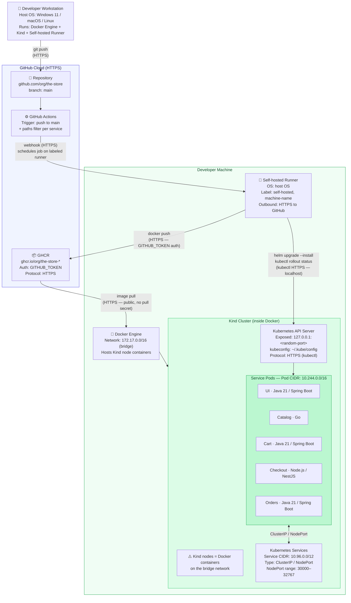

# Pre-Delivery — CI/CD for The Store
**Course Assignment | Team: 3 members | Topic #7 — CI/CD**

---

## 1. Problem Statement and Context

This project addresses **Course Topic #7: CI/CD for Service Deployment and Management**.

**The Store** is a polyglot microservices e-commerce platform composed of five independently deployable services (UI, Catalog, Cart, Checkout, Orders) written across Java, Go, and Node.js. Each service is packaged with its own Dockerfile; a dedicated per-service Helm chart is authored as part of this project to replace the current flat `dist/kubernetes.yaml` manifest. The platform runs on a Kubernetes cluster managed with Kind.

Without a CI/CD pipeline, any code change requires a developer to manually build the Docker image, push it to a registry, and run Helm to update the cluster. This process is slow, error-prone, and not reproducible across team members. In a microservices environment, the problem compounds: five services means five independent build-and-deploy sequences, each of which can fail silently if not automated and verified.

The goal is to implement a fully automated pipeline that, on every push to `main`, builds the affected service's image, runs its tests, publishes the image to a registry, and deploys it to the local Kubernetes cluster — with **zero manual steps after initial environment setup** and zero cloud cost.

---

## 2. Solution Design

### Toolchain

| Tool | Role |
|---|---|
| **GitHub Actions** | Full CI/CD orchestration — triggered on push to `main`; runs on self-hosted runners |
| **Self-hosted runner** | Installed on each developer's machine; reaches the local Kind API server directly via `localhost` |
| **Docker** | Builds service images from per-service Dockerfiles; also hosts Kind nodes as containers |
| **GHCR** (`ghcr.io`) | Image registry — free, native GitHub auth via `GITHUB_TOKEN`; public images require no pull secret in Kind |
| **Helm** | Deploys each service into the Kind cluster using its dedicated per-service chart (authored as part of this project) |
| **Kind** | Local Kubernetes cluster; nodes run as Docker containers on the developer's machine |

### Pipeline Structure

One workflow file per service: `.github/workflows/<service>.yml`  
Each workflow is scoped with a `paths:` filter so it only triggers when its own source tree changes.

```
src/ui/**       → .github/workflows/ui.yml
src/catalog/**  → .github/workflows/catalog.yml
src/cart/**     → .github/workflows/cart.yml
src/checkout/** → .github/workflows/checkout.yml
src/orders/**   → .github/workflows/orders.yml
```

The POC commits to **five fully working pipelines** — one per deployable service (UI, Catalog, Cart, Checkout, Orders) — at defense time. Each pipeline is structurally identical; the pattern is described once in §2 and replicated across the five workflow files.

### Pipeline Stages (per service)

```
Push to main
    │
    ▼
[1] Checkout source code
    │
    ▼
[2] Build Docker image
    (docker build -t ghcr.io/<org>/the-store-<service>:<sha>)
    │
    ▼
[3] Run unit / build-time tests  ← GATE: pipeline stops here on failure
    (existing per-service test suites)
    │  failure → no image pushed, no deployment
    ▼
[4] Push image to GHCR
    (HTTPS — authenticated via GITHUB_TOKEN secret)
    │
    ▼
[5] Helm upgrade --install
    (kubeconfig from ~/.kube/config on runner machine)
    │
    ▼
[6] Verify pod health
    (kubectl rollout status deployment/<service>)
```

**Failure behavior:** if stage [3] (tests) fails, the pipeline aborts immediately — the image is never pushed to GHCR and no deployment occurs. If stage [6] (rollout verification) fails, the pipeline runs `helm rollback` to return the release to its previous working revision before exiting non-zero, so a bad deployment never lingers in the cluster.

### Key Design Decisions

- **Trigger:** push to `main` with `paths:` filter — only the changed service's pipeline runs.
- **Runner label:** each team member's machine registers a self-hosted runner with a unique label (e.g., `self-hosted, machine-berni`). Each workflow's `runs-on:` field pins this label explicitly, so GitHub can only dispatch the job to the designated runner — this removes any routing ambiguity between team members' machines.
- **Image tag:** Git commit SHA — ensures every push produces a uniquely identifiable image; `latest` is never used in deployments.
- **Authentication:** `GITHUB_TOKEN` (auto-provisioned by GitHub Actions) is used to authenticate `docker push` to GHCR. Each workflow declares `permissions: packages: write` explicitly so the token has GHCR push scope. No additional secrets need to be created; Kind nodes pull the image over public HTTPS without a pull secret.
- **Kubeconfig:** the runner accesses the Kind cluster via `~/.kube/config` on the host machine, which Kind writes automatically on cluster creation. The API server is reachable at `127.0.0.1:<mapped-port>` (localhost only).
- **Databases:** all services run in in-memory fallback mode — no external DB provisioning required.
- **Cost:** $0 — self-hosted runners consume zero GitHub Actions minutes; GHCR public images are free.

---

## 3. POC Scope and Use Cases

### In Scope

| Use Case | Description |
|---|---|
| **Service build** | Docker image built from per-service Dockerfile on push to `main` |
| **Automated testing** | Each service's existing unit/build-time test suite runs as a pipeline gate |
| **Failure gating** | Pipeline stops before push/deploy if tests fail |
| **Image publish** | Built and tested images pushed to GHCR with the commit SHA as tag |
| **Automated deployment** | Helm deploys the new image to the local Kind cluster |
| **Health verification** | `kubectl rollout status` confirms pods are running before pipeline completes |
| **Per-service isolation** | A change to `src/catalog/` only triggers the catalog pipeline |

### Out of Scope

| Item | Reason |
|---|---|
| E2E / Cypress tests in pipeline | Requires a full running stack — adds complexity outside the CI/CD goal |
| Load tests (Artillery) | Not a correctness gate for deployment |
| External databases | In-memory fallbacks are sufficient for demonstrating the pipeline |
| Multi-environment promotion | One local Kind cluster per developer — no staging/prod separation needed |
| Shared/remote Kubernetes cluster | Cost constraint; per-machine Kind clusters are sufficient |
| `load-generator` pipeline | `src/load-generator/` is a dev-only load-testing tool, not a deployable platform service — excluded from CI/CD scope |

### Demo Scenario

The live demonstration will consist of:
1. Making a small visible change to one service (e.g., a UI label).
2. Pushing the commit to `main`.
3. Showing the GitHub Actions workflow run in real time (build → test → push → deploy stages).
4. Confirming the change is live in the Kind cluster by accessing the service.
5. Introducing a deliberate test failure to show the pipeline stops before deploying and that no image is pushed to GHCR.

---

## 4. Architecture Diagram



### Network Summary

| Network | CIDR / Address | Scope |
|---|---|---|
| Docker bridge (Kind nodes) | `172.17.0.0/16` | Host-local — Docker containers |
| Kind Pod network | `10.244.0.0/16` | Internal — pod-to-pod traffic |
| Kind Service network | `10.96.0.0/12` | Internal — stable cluster service IPs |
| NodePort range | `30000–32767` | Exposed from Kind nodes to host |
| Host → Kind API | `127.0.0.1:<mapped-port>` | Localhost only — runner to API server |
| Runner → GHCR | Public internet | HTTPS outbound |
| Runner → GitHub | Public internet | HTTPS outbound (webhook + API) |

### Authentication & Transport per Hop

| Hop | Transport | Authentication |
|---|---|---|
| Developer → GitHub (`git push`) | HTTPS (TLS 1.2+) | SSH key or HTTPS PAT |
| GitHub → Runner (job dispatch) | HTTPS long-poll initiated by runner | Runner registration token |
| Runner → GHCR (`docker push`) | HTTPS (TLS 1.2+) | `GITHUB_TOKEN` with `packages: write` |
| Kind node → GHCR (`image pull`) | HTTPS (TLS 1.2+) | Anonymous (public image) |
| Runner → Kind API (`kubectl` / `helm`) | HTTPS (TLS) over `127.0.0.1` | Client cert in `~/.kube/config` |

### Per-Machine Configuration

Each team member registers exactly one self-hosted runner on their workstation, tagged with a unique label of the form `self-hosted, machine-<member-name>` and using the local `~/.kube/config` that Kind writes on cluster creation.

**Runner isolation guarantee:** each workflow file pins `runs-on:` to a unique machine label, so GitHub will only dispatch the job to the designated runner regardless of which other runners are online.

---

## 5. Alternative Solutions Considered

### 5.1 AWS CodePipeline + ECR + EKS

AWS CodePipeline with CodeBuild would handle CI, ECR would serve as the image registry, and EKS would run the cluster.

**Rejected because:** ECR storage, CodeBuild compute minutes, and EKS node time all generate real costs. The assignment explicitly discourages paid solutions, and managing cloud IAM roles and VPC networking adds significant configuration overhead that is not relevant to demonstrating CI/CD concepts. GitHub Actions achieves the same pipeline goals at zero cost.

### 5.2 Jenkins as CI (alongside GitHub Actions for CD)

Jenkins would handle the build and test stages while GitHub Actions (or manual Helm) would handle deployment. Both tools would need to be configured and kept in sync.

**Rejected because:** splitting CI and CD across two systems introduces additional operational complexity — two credential stores, two trigger mechanisms, and two log systems to debug. While Jenkins is a mature and capable tool that would also satisfy the requirements, GitHub Actions alone covers both CI and CD with a single workflow file per service and native GHCR integration, reducing the overall configuration surface for a team of three.

### 5.3 Single Monolithic Pipeline for All Services

One GitHub Actions workflow that builds and deploys all five services on every push, regardless of which service changed.

**Rejected because:** a change to a single file in `src/catalog/` would trigger full rebuilds of all five services — including slow Java Maven builds and Go compilation — wasting time and making it harder to trace which service caused a failure. Per-service pipelines with `paths:` filters are standard practice in microservices CI/CD and better reflect a realistic production setup.
