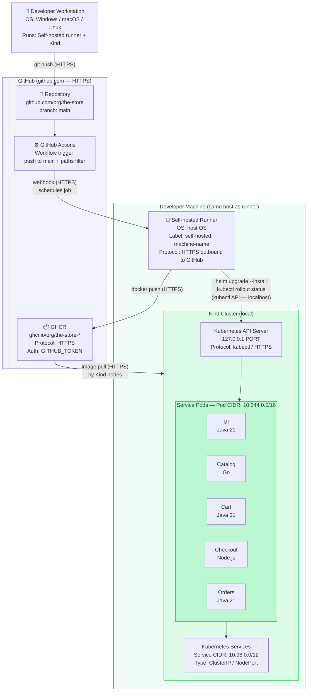

# Pre-Delivery — CI/CD for The Store
**Course Assignment | Team: 3 members**

---

## 1. Problem Statement and Context

**The Store** is a polyglot microservices e-commerce platform composed of five independently deployable services (UI, Catalog, Cart, Checkout, Orders) written across Java, Go, and Node.js. Each service has its own Dockerfile and Helm chart, and the platform runs on a Kubernetes cluster managed with Kind.

Without a CI/CD pipeline, any code change requires a developer to manually build the Docker image, push it to a registry, and run Helm to update the cluster. This process is slow, error-prone, and not reproducible across team members. In a microservices environment, the problem compounds: five services means five independent build-and-deploy sequences, each of which can fail silently if not automated and verified.

The goal is to implement a fully automated pipeline that, on every push to `main`, builds the affected service's image, runs its tests, publishes the image to a registry, and deploys it to the local Kubernetes cluster — with Zero manual steps after initial environment setup and zero cloud cost.

---

## 2. Solution Design

### Toolchain

| Tool | Role |
|---|---|
| **GitHub Actions** | Full CI/CD orchestration — triggered on push to `main`; runs on self-hosted runners |
| **Self-hosted runner** | Installed on each developer's machine; allows the runner to reach the local Kind API server directly |
| **Docker** | Builds service images from per-service Dockerfiles |
| **GHCR** (`ghcr.io`) | Image registry — free, native GitHub auth, public images require no pull secret in Kind |
| **Helm** | Deploys each service into the Kind cluster using existing per-service charts |
| **Kind** | Local Kubernetes cluster running on each developer's machine |

### Pipeline Structure

One workflow file per service: `.github/workflows/<service>.yml`  
Each workflow is scoped with a `paths:` filter so it only runs when its own source tree changes.

```
src/ui/**       → .github/workflows/ui.yml
src/catalog/**  → .github/workflows/catalog.yml
src/cart/**     → .github/workflows/cart.yml
src/checkout/** → .github/workflows/checkout.yml
src/orders/**   → .github/workflows/orders.yml
```

### Pipeline Stages (per service)

```
Push to main
    │
    ▼
[1] Checkout source code
    │
    ▼
[2] Build Docker image
    (docker build -t ghcr.io/<org>/the-store-<service>:<sha>)
    │
    ▼
[3] Run unit / build-time tests
    (existing per-service test suites)
    │
    ▼
[4] Push image to GHCR
    (HTTPS — authenticated via GITHUB_TOKEN)
    │
    ▼
[5] Helm upgrade --install
    (targets local Kind cluster via kubeconfig on runner machine)
    │
    ▼
[6] Verify pod health
    (kubectl rollout status deployment/<service>)
```

### Key Design Decisions

- **Trigger:** push to `main` with `paths:` filter — only the changed service's pipeline runs.
- **Runner label:** each team member's machine uses a unique label (e.g., `self-hosted, machine-alice`) so GitHub never routes a job to the wrong environment.
- **Image tag:** Git SHA — ensures every push produces a uniquely identifiable image; no `latest` tag used in deployments.
- **Databases:** all services run in in-memory fallback mode — no external DB provisioning required in the CI/CD environment.
- **Cost:** $0 — self-hosted runners consume zero GitHub Actions minutes; GHCR public images are free.

---

## 3. POC Scope and Use Cases

### In Scope

| Use Case | Description |
|---|---|
| **Service build** | All 5 services are built via Docker on push to `main` |
| **Automated testing** | Each service's existing unit/build-time test suite runs in the pipeline |
| **Image publish** | Built images are pushed to GHCR with the commit SHA as tag |
| **Automated deployment** | Helm deploys the new image to the local Kind cluster |
| **Health verification** | `kubectl rollout status` confirms pods are running before the pipeline completes |
| **Per-service isolation** | A change to `src/catalog/` only triggers the catalog pipeline |

### Out of Scope

| Item | Reason |
|---|---|
| E2E / Cypress tests in pipeline | Requires a running full stack — adds complexity outside the CI/CD demonstration goal |
| Load tests (Artillery) | Not a gate for deployment correctness |
| External databases | In-memory fallbacks are sufficient to demonstrate the deployment pipeline |
| Multi-environment promotion | One environment (local Kind) per developer — no staging/prod separation needed for this POC |
| Shared/remote Kubernetes cluster | Cost constraint; per-machine Kind clusters are fully sufficient |

### Demo Scenario

The live demonstration will consist of:
1. Making a small visible change to one service (e.g., a label in the UI).
2. Pushing the commit to `main`.
3. Showing the GitHub Actions workflow run in real time (build → test → push → deploy stages).
4. Confirming the change is live in the Kind cluster by accessing the service.
5. If tests fail, the pipeline stops before pushing the image or deploying.

---

## 4. Architecture Diagram



### Network Summary

| Network | CIDR | Scope |
|---|---|---|
| Kind Pod network | `10.244.0.0/16` | Internal — pod-to-pod communication |
| Kind Service network | `10.96.0.0/12` | Internal — stable cluster service IPs |
| Host → Kind API | `127.0.0.1:<kind-port>` | localhost only — runner to cluster |
| Runner → GHCR | Public internet | HTTPS outbound |
| Runner → GitHub | Public internet | HTTPS outbound (webhook + API) |

### Per-Machine OS

| Team Member | Host OS | Runner Label |
|---|---|---|
| Member 1 | Windows 11 | `self-hosted, machine-berni` |
| Member 2 | *(to be confirmed)* | `self-hosted, machine-<name>` |
| Member 3 | *(to be confirmed)* | `self-hosted, machine-<name>` |

---

## 5. Alternative Solutions Considered

### 5.1 AWS CodePipeline + ECR

AWS CodePipeline with CodeBuild would handle CI, and ECR would serve as the image registry. Deployments would target an EKS cluster.

**Rejected because:** ECR storage, CodeBuild compute minutes, and EKS node time all incur real AWS costs. The assignment explicitly discourages solutions with financial cost, and there is no educational advantage over GitHub Actions for the CI/CD concepts being demonstrated.

### 5.2 Jenkins + GitHub Actions (Split CI/CD)

Jenkins would handle the build and test stages while GitHub Actions (or manual Helm) would handle deployment. Jenkins would run as a container or local install.

**Rejected because:** splitting CI and CD across two tools doubles the configuration surface: two credential stores, two trigger mechanisms, two sets of logs to debug. GitHub Actions alone handles both CI and CD with a single workflow file per service, less operational overhead, and native GHCR integration — achieving the same result with less complexity.

### 5.3 Single Monolithic Pipeline for All Services

One GitHub Actions workflow that builds and deploys all five services on every push, regardless of which service changed.

**Rejected because:** a change to a single line in `src/catalog/` would trigger full rebuilds of all five services (including Java Maven builds and Go compilation), wasting time and obscuring which service actually changed. Per-service pipelines with `paths:` filters are standard microservices practice and better reflect a real production setup.
